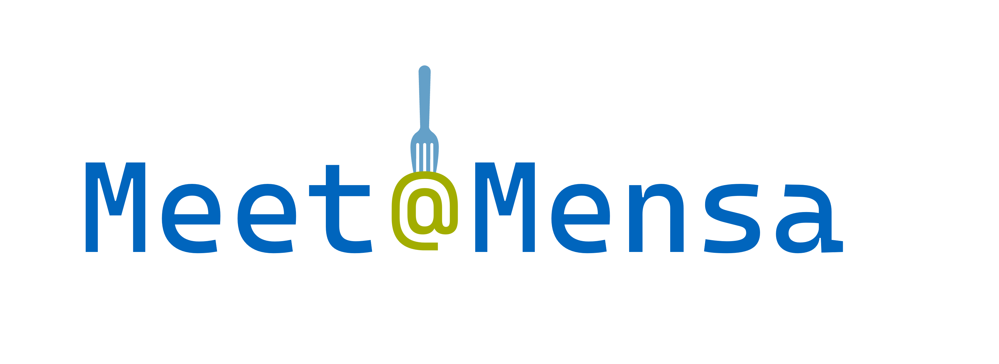

# 🍲 Meet@Mensa

Many students at TUM, particularly in the larger study programs, report feeling lonely and isolated despite having countless peers. One of the places where this is especially noticeable is the Mensa during lunchtime. It's common for students that don't have a strong network of friends at university to eat alone or avoid eating at the Mensa entirely to not feel socially awkward.

Our tool - *Meet@Mensa* - focuses on transforming the potentially uncomfortable situation of eating alone at the Mensa into an opportunity to meet fellow students and make new friends.

## 📺 Live Demo

Check it out for yourself at [app.meetatmensa.com](https://app.meetatmensa.com)!

## 🥘 Features

### Sign up
Create an account and meet@mensa will store your basic information for next time!

### Request Matches
Let us know who you'd like to meet and when you're available by submitting a Match Request!

### Get Matched
Every night at 22:00 CET, our algorithm will run and try to find the best group for you! Group bailed on you or you're just feeling spontaneous? We'll try matching you again at 10:00am CET. 

### RSVP
Got matched? Let us know if you can make it by clicking the RSVP button!

### Meet People
Show up, have lunch, make friends. Simple as that!

### Break the Ice
Talking to new people can be hard at the start, so meet@mensa takes advantage of modern GenAi to help break the ice! Check your match for custom conversation starters for you and the people you'll be meeting!

## ⚙ System Overview

### Class Diagram (analysis object model)

### Use Case Diagram

### Component Diagram (top-level architecture)

## 🎭 Use Case Scenarios

