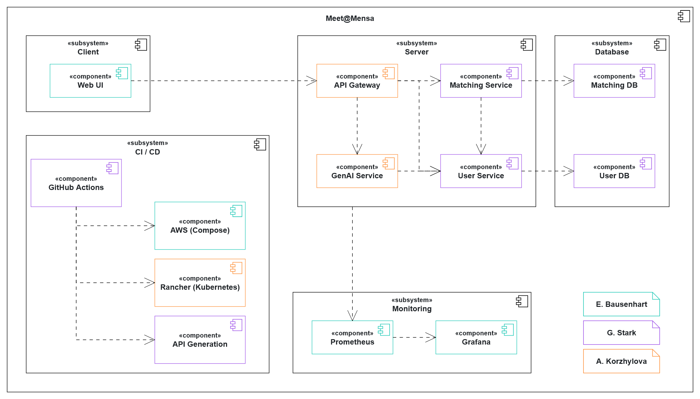

[](https://github.com/AET-DevOps25/team-devoops/actions/workflows/ci.yml)

[](https://github.com/AET-DevOps25/team-devoops/actions/workflows/ci_cd.yml)

Many students at TUM, particularly in the larger study programs, report feeling lonely and isolated despite having countless peers. One of the places where this is especially noticeable is the Mensa during lunchtime. It's common for students that don't have a strong network of friends at university to eat alone or avoid eating at the Mensa entirely to not feel socially awkward.

Our tool - *Meet@Mensa* - focuses on transforming the potentially uncomfortable situation of eating alone at the Mensa into an opportunity to meet fellow students and make new friends.

# 🥘 Features

## Sign up
Create an account and meet@mensa will store your basic information for next time!

## Request Matches
Let us know who you'd like to meet and when you're available by submitting a Match Request!

## Get Matched
Every night at 22:00 CET, our algorithm will run and try to find the best group for you! Group bailed on you or you're just feeling spontaneous? We'll try matching you again at 10:00am CET. 

## RSVP
Got matched? Let us know if you can make it by clicking the RSVP button!

## Meet People
Show up, have lunch, make friends. Simple as that!

## Break the Ice
Talking to new people can be hard at the start, so meet@mensa takes advantage of modern GenAi to help break the ice! Check your match for custom conversation starters for you and the people you'll be meeting!

# 🚀 Installation and Deployment

## Live Demo
Check it out for yourself at [app.meetatmensa.com](https://app.meetatmensa.com)!

## Deploy it Yourself
Instructions for deploying with Docker-Compose and Kubernetes  are available [here](deployment/README.md)

# 🔭 Repository Overview

```
meet@mensa/
├── api/
│   ├── changelogs/ # All updates to the API spec       # All changes to our API, documented
│   ├── scripts/ # Scripts for generating API code      # Scripts for generating code based on API spec
│   └── openapi.yaml                                    # The API definition itself
│                                    
├── client/                                             # Our React-based client
│ 
├── deployment/                                         
│   ├── docker/                                         # Deploy meet@mensa locally!
│   ├── docker-debug/                                   # Deploy meet@mensa locally with exposed backend services
│   ├── k8s/                                            # Deploy meet@mensa to TUM's Kubernetes Cluster
│   └── compose.aws.yml                                 # Deploy meet@mensa to AWS
│ 
├── docs/
│   ├── api.html                                        # API spec (https://aet-devops25.github.io/team-devoops/api.html)
│   └── problem_statement.md                            # Meet@Mensa problem statement
│ 
├── infrastructure/                                     # Terraform scripts for AWS deployment
│ 
├── resources/                                          # Images and Diagrams used elsewhere
│ 
├── server/                                             # Our back-end
│   ├── database/
│   │   ├── matchdb/                                    # Databases for matching-data
│   │   └── userdb/                                     # Databases for user-data
│   │
│   ├── gateway/                                        # Routes traffic to our API
│   │
│   ├── genai/                                          # Provides conversation starters
│   │
│   ├── matching/                                       # Manages matching requests
│   │   ├── src/                                        # Spring-Boot Application
│   │   ├── generated/                                  # Server API interface generated with openapi-generate-cli
│   │   └── generated-client/                           # Client API interface generated with openapi-generate-cli
│   │
│   └── user/                                           # Manages users
│       ├── src/                                        # Spring-Boot Application
│       ├── generated/                                  # Server API interface generated with openapi-generate-cli
│       └── generated-client/                           # Client API interface generated with openapi-generate-cli
│ 
├── README.md                                           # You're reading it ;)
├── CONTRIBUTING.md                                     # Join us
└── LICENSE                                             # MIT
```


# ⚙ System Overview

### Component Diagram (top-level architecture)
This model contains information about Meet@Mensa's architecture. Each component's color indicates the student responsible for it.



### Class Diagram (analysis object model)
This model contains information about the objects handled by the Meet@Mensa API. Detailed class diagrams for User and Matching services are available in their respective README.md files ([User](server/user/README.md), [Matching](server/matching/README.md)).


### Use Case Diagram
This model contains information about Meet@Mensa's use-cases.


# 💜 More Documentation

There's much more to see, check it out!
- [API Spec](https://aet-devops25.github.io/team-devoops/api.html)
- [Problem Statement](docs/problem_statement.md)
- [Grafana Dashboards]() # TODO Add
- [CI/CD Pipeline]() # TODO Add
- [Matching Algorithm](server/matching/README.md)