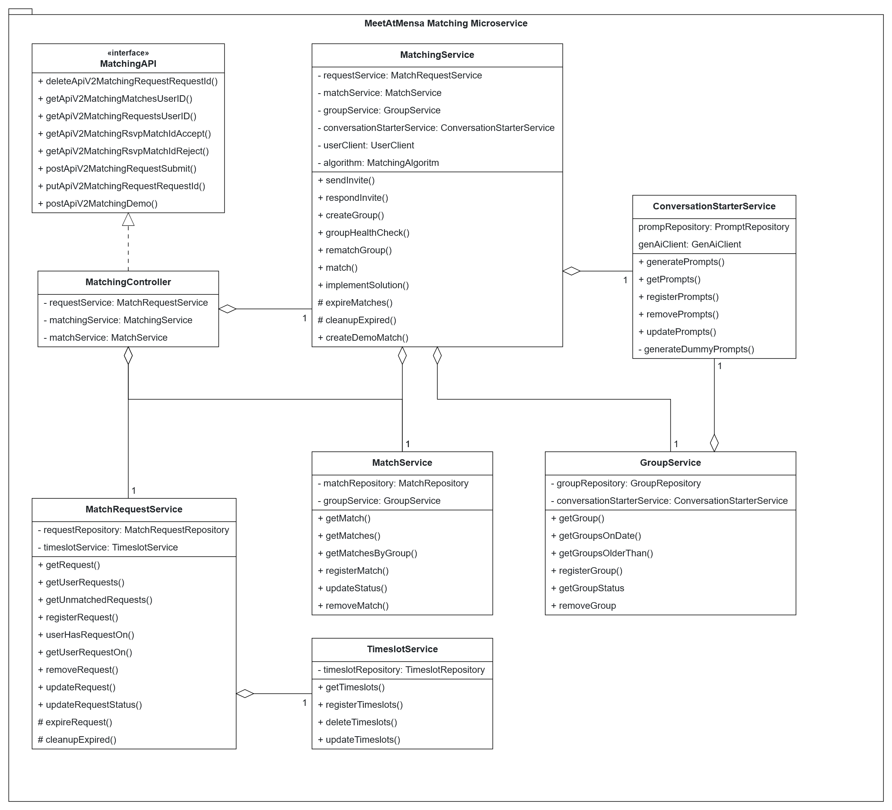

# Meet@Mensa Matching Microservice

A Spring Boot application built with Gradle supporting the matching process in the Meet@Mensa app.

## Class Diagram
Diagram showing the basic class structure for the Matching Microservice


## Local Deployment with Docker
```
# Build and tag the Docker image
docker build -t ghcr.io/aet-devops25/team-devoops/server/matching .

# Push the image to GHCR (latest tag by default, access needed)
docker push ghcr.io/aet-devops25/team-devoops/server/matching

# Run the Docker container on port 8082
docker run --name matching-service -p 8082:80 ghcr.io/aet-devops25/team-devoops/server/matching

# List running containers (if needed) 
docker ps

# Stop the container     
docker stop matching-service

# Remove the container     
docker remove matching-service
```

The application will be available at `http://localhost:8082` and `http://localhost:8082/matching`.